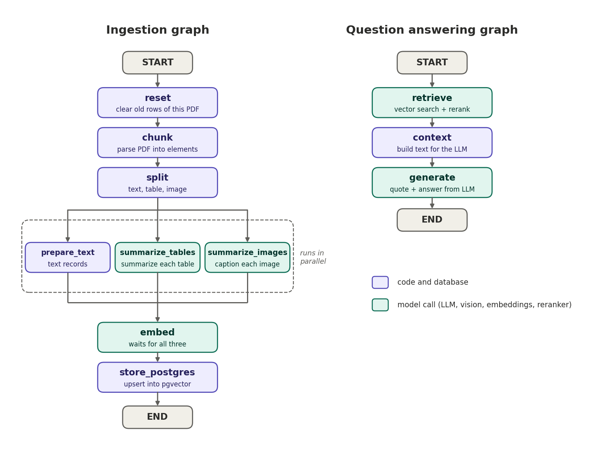

# Multimodel RAG

A PDF question-answering app that extracts text, tables, and images, stores vector embeddings in PostgreSQL with pgvector, and answers questions using Hugging Face models.

## Features

- Extracts text, tables, and images from PDFs (Unstructured `hi_res` parsing with Tesseract OCR)
- Summarizes each table with an LLM and captions each image with a vision model, then embeds the summaries and keeps the originals
- Stores everything in PostgreSQL with pgvector, using deterministic IDs so re-processing a PDF updates rows instead of duplicating them
- Retrieves with vector search, then reranks candidates with a cross-encoder
- Answers with a quoted piece of evidence and page numbers
- Streamlit chat interface and a terminal mode

## How it works



Ingestion (LangGraph):

```
reset -> chunk -> split -> [prepare_text | summarize_tables | summarize_images] -> embed -> store_postgres
```

The three middle nodes run in parallel and `embed` waits for all of them.

Question answering (LangGraph):

```
retrieve (vector search + rerank) -> context -> generate
```

## Requirements

- Python 3.11 or newer
- PostgreSQL with the pgvector extension available
- A Hugging Face access token with access to the models configured in `backend.py`
- Tesseract OCR installed and available on `PATH` (the Windows installer commonly adds `C:\Program Files\Tesseract-OCR`)

## Setup

```powershell
python -m venv .venv
.\.venv\Scripts\Activate.ps1
python -m pip install -r requirements.txt
Copy-Item .env.example .env
```

Set `DATABASE_URL` and `kk` (your Hugging Face token) in `.env`. The database user must be able to enable PostgreSQL extensions. The app creates its `chunks` table and pgvector indexes when it runs.

### Database with Docker

If you do not have PostgreSQL with pgvector, this starts one that matches the `DATABASE_URL` in `.env.example`:

```powershell
docker run -d --name pgvector -e POSTGRES_PASSWORD=postgres -e POSTGRES_DB=ragdb -p 5432:5432 pgvector/pgvector:pg16
```

The plain `postgres` image does not include pgvector.

## Configuration

| Setting | Where | Purpose |
|---|---|---|
| `DATABASE_URL` | `.env` | PostgreSQL connection string |
| `kk` | `.env` | Hugging Face access token |
| `PDF_PATH` | `.env` | PDF used by the command-line pipeline (default: `2018121815819.pdf`) |
| `VISION_MODEL` | `backend.py` | Vision model used to caption images; it must be served by a provider enabled on your Hugging Face account |
| `USE_RERANK`, `FETCH_K`, `TOP_K`, `MIN_SCORE` | `ret.py` | Retrieval and reranking behavior |

## Run

Start the web app:

```powershell
streamlit run stream_ui.py
```

In the sidebar, upload a PDF and click **Process document**, or pick a document that is already in the database, then ask questions in the chat.

Run ingestion followed by an interactive question session:

```powershell
python main.py
```

Skip ingestion and ask questions about a document already in the database:

```powershell
python main.py ask
```

Uploading or processing a file with the same name as an existing document replaces that document's stored rows.

## Project structure

| File | Purpose |
|---|---|
| `backend.py` | Models, database helpers, and the ingestion nodes |
| `ret.py` | Retrieval: vector search, reranking, and context building |
| `main.py` | State definition, ingestion graph, question-answering graph, and terminal mode |
| `stream_ui.py` | Streamlit chat interface |

## Troubleshooting

- **`extension "vector" is not available`**: PostgreSQL does not have pgvector installed. Use the `pgvector/pgvector` Docker image or install the pgvector package on your server.
- **`KeyError: 'DATABASE_URL'` or `KeyError: 'kk'`**: set both in `.env`.
- **Image captions fail with `model_not_supported`**: enable an inference provider in your Hugging Face settings, or change `VISION_MODEL` to a model your provider serves. Images fall back to their OCR text when captioning fails.
- **Tesseract or Poppler errors**: confirm Tesseract is on `PATH`. If `unstructured` reports a Poppler error, install Poppler and add its `bin` folder to `PATH`.
- **Short questions return a weak answer**: ask a more specific question, or raise `FETCH_K` in `ret.py` so more candidates are reranked.

The included PDFs are small sample documents. Uploaded files, extracted images, local environments, and credentials are excluded from Git.